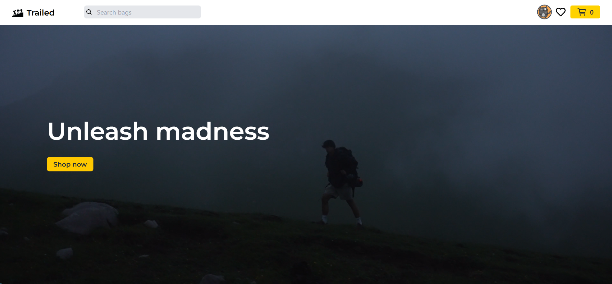

# TopG Portfolio 🚀

> **A modern, responsive portfolio website built with React, Tailwind CSS, and Vite.**

## 📌 Live Demo

🌐 [View Live Site](https://top-g-portfolio.vercel.app/) *(update with your actual link if different)*

---

## 📖 About

This is my personal developer portfolio to showcase my:
- Skills (HTML, CSS, JavaScript, ReactJS, Tailwind CSS, Git, etc.)
- Projects built during learning and internships
- Certifications
- Resume download
- Contact form

> Designed with simplicity, responsiveness, and performance in mind.

---

## ⚙️ Tech Stack

- 💻 **Frontend:** ReactJS, Vite, Tailwind CSS
- 📁 **Routing & Navigation:** React Scroll
- 📄 **Deployment:** GitHub Pages / Vercel (Optional)

---

## 📷 Screenshots

| Home Section | Projects Section | Certifications |
|--------------|------------------|----------------|
|  |  |  |

---

## 📂 Folder Structure

```bash
TopG-Portfolio/
├── public/
├── src/
│   ├── assets/
│   ├── components/
│   ├── utils/
│   ├── App.jsx
│   ├── main.jsx
├── tailwind.config.js
├── vite.config.js
└── README.md
